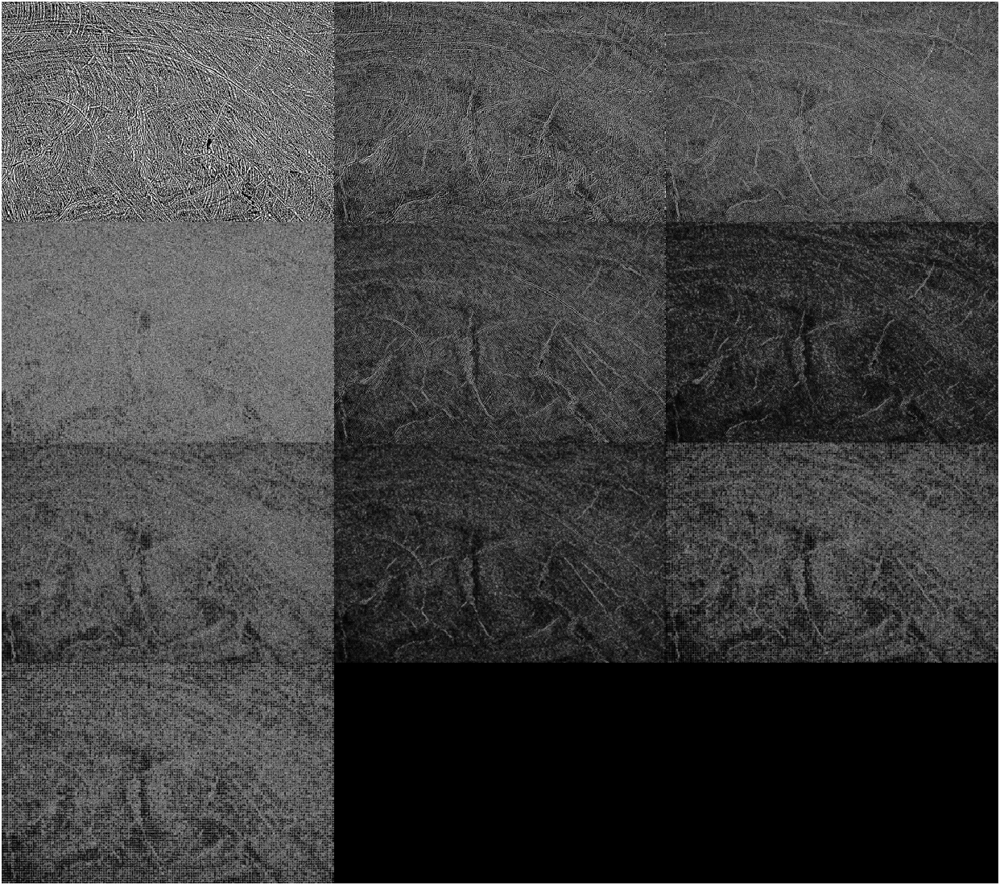
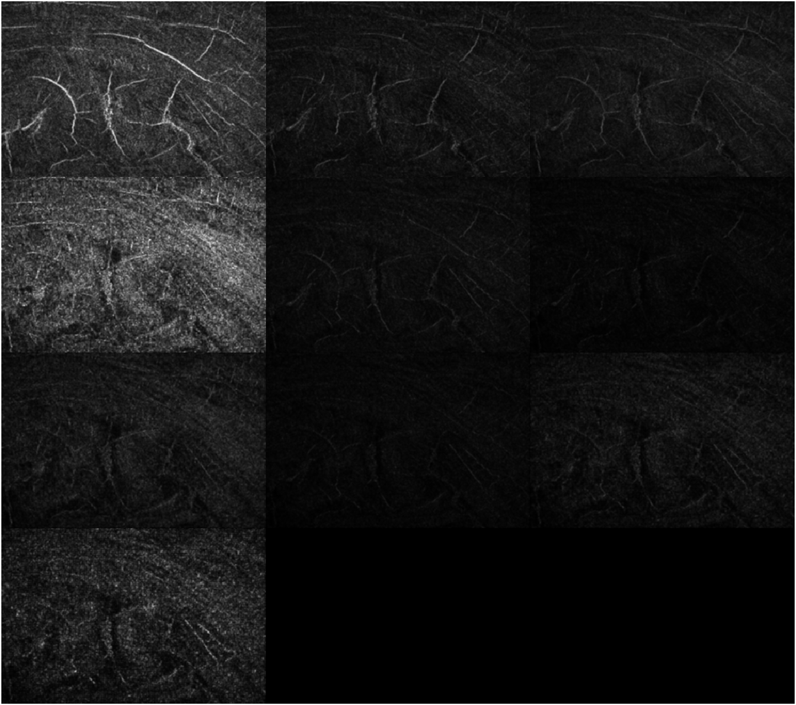

# Introduction
 

Texture segmentation and recognition is an important task in image processing. In this repository, Law's texture filter is implemented to calculate the multi-dimensional feature vector for a given image. Four types of Law's texture filters are supported, these filter sizes are 3 x 3, 4 of 5 x 5, 5 of 5 x 5 and 7 of 7 x 7. In addition, the Law's texture filter and energy maps outputs are available. The feature vector is a multi-dimensional normalized feature vector of energy maps.

# Filter outputs:
| Images |
| ------ |
| Laws' filters response | 
|  |
| Energy maps | 
|  |

# Requirements
MATLAB  
MATLAB Image Processing Toolbox  

# Feedback
Please rate and provide feedback for the further improvements.
